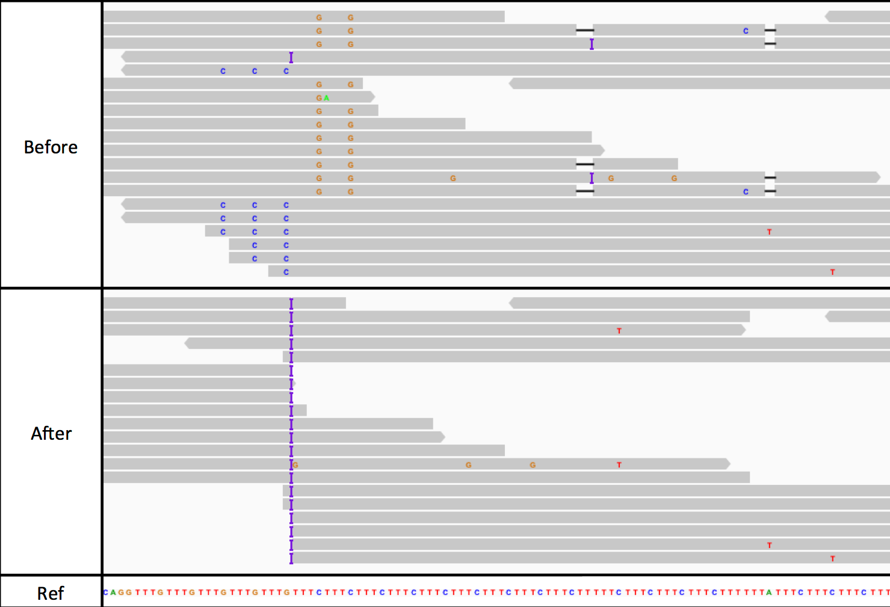

- build by Raphael Hablesreiter

# Demultiplexing

## Sample sheet

To demultiplex Illumina basecalls into different samples, `bcl2fastq` can be used ([>LINK<](https://emea.support.illumina.com/sequencing/sequencing_software/bcl2fastq-conversion-software.html)). It has to be executed in the base directory of the sequencing run (the one with the `RunInfo.xml` in it). A `SampleSheet.csv` has to be created containing the (7') barcode indexes for each sample. If UMIs are presend, their length can be given in sample sheet.
For the demultiplexing to run, we need a sample sheet. An template can be downloaded here [>LINK<](https://sapac.support.illumina.com/downloads/sample-sheet-v2-template.html)

Here is an example

```
[Header],,,
FileFormatVersion,2,,
MyRunName,P1557,,
InstrumentPlatform,NextSeq6000,,
InstrumentType,NextSeq6000,,
,,,
[Reads],,,
Read1Cycles,148,,
Index1Cycles,17,,
Index2Cycles,8,,
Read2Cycles,148,,
,,,
[Data],,,
Lane,Sample_ID,Sample_Name,index,index2
1,S-BeLOV-248164,S-BeLOV-248164,CTGATCGT,GCGCATAT
1,S-BeLOV-248536,S-BeLOV-248536,ACTCTCGA,CTGTACCA
```

The information comes from the library file.
**The index2 has to be the *reverse complement!***. This can be done using this link \[[>LINK<](https://arep.med.harvard.edu/labgc/adnan/projects/Utilities/revcomp.html)\]

## config file

This file has to give the paths to different annotation files. Especially important are

- readstructure: This has to be adjusted to the run. see below
- region file: make sure you have the correct target file
- picard-> memoryusage: Adjust for bigger datasets

### Readstructure

The *readstructure* tells the demultiplexer which part of the reads is an adapter, and what is the sequence. Information about this can be found in `RunInfo.txt` and the meta data file with the barcodes.

```
<Read Number="1" NumCycles="151" IsIndexedRead="N"/>
<Read Number="2" NumCycles="8" IsIndexedRead="Y"/>
<Read Number="3" NumCycles="10" IsIndexedRead="Y"/>
<Read Number="4" NumCycles="151" IsIndexedRead="N"/>
```

Means:

```
151T8B10M8B151T
```

- `151T`: 151bp transcript
- `8B`: 8bp barcode sample
- `10M`: 10bp barcode molecular (UMI)
- also `S`: skip

If you have no information, one can also just convert the entire sequences to fastq without de-multiplexing and without trimming. Note that you need to set the entire read length to template. **151T** in this example. Then you can `grep` the barcodes and stuff.

```
picard  IlluminaBasecallsToFastq B=./{MY_RUN}/Data/Intensities/BaseCalls/ L=1 RS=151T INCLUDE_NON_PF_READS=false COMPRESS_OUTPUTS=false RUN_BARCODE=MY_RUN OUTPUT_PREFIX=MY_RUN READ_NAME_FORMAT=ILLUMINA  NUM_PROCESSORS=1 IGNORE_UNEXPECTED_BARCODES=false FORCE_GC=false
```

# Preprocessing


1.  **map_reads1**: The BAM files are converted to FASTQ, and then the FASTQ files are mapped to the genome.
    
2.  **Group reads**: Sequences are grouped accoring to their UMI sequence.
    
3.  **Consensus reads**: PCR can introduce errors, which can be indistinguishable from *real* mutations. Therefor, the reads are grouped by their UMIs, and only the consensus sequences are kept. Here, Consensus reads filters all reads that don't appear *at least three times per UMI*.
    
4.  **map_reads2**: Consensus sequences mapped to the genome again.
    
5.  **FilterConsensusReads**: Reads can be filtered here according to base quality or consensus error rate.
    
6.  **local realignment**:
    
    - Around known indels, local realignments are performend. Especially towards the end of reads, "mismatch" is cheaper than gap opening, leading to false positives.
    - genome aligners can only consider each read independently
    - local realignment considers all reads spanning a given position
        - parsimonious alignment of reads
            
            

# Variant calling

1.  **vardict**: single (end) mode. *Vardict* has the following features:
    - “ultra sensitive variant caller for [..] variant calling from BAM files”
    - philosophy is to “call everything”, and filter later
    - calls SNV, MNV, InDels, complex and structural variants
    - insertions and deletions often work as tandem
    - if InDel is detected, surrounding area is scanned for more InDels or mismatches
        - combination to one complex variant
    - calling of structural variants with paired end data
    - works with amplicons/targeted sequencing; single end only

2.  **ebfilter**: Empirical Bayesian false positive filtering of somatic mutations in cancer genome sequencing. This is done via:
    
- **if you do not have a healthy control, set the value to "False" in the config file**
- estimating sequencing error model using *control* sequencing data
- compare mismatch ratio with observed mismatch ratio of tumor samples
- if the mismatch ratio of the tumor sample significantly deviates from the predicted mismatch ratio, it is probably a highly likely somatic mutation
- Since we usually don't have healthy control, this should not be done.
- An alternative is using random tumor samples as background.

3.  **annovar**:

# Technical questions:

> How are we going to to CNV on a targeted panel?

The SNP backbone is more or less evenly distributed over the genome and will serve as a stand-in for WES.

# Glossary

AML
: Acute Myeloische Leukemia

HSC
: hematopoietic stem cell

HSCT
: hematopoietic stem cell transplantation

CDR
: commonly deleted region

VAF
: variant allel frequency

UMI Adapters
: PCR can introduce errors, which can be indistinguishable from *real* mutations. Therefor, every strand of sequenced DNA is marked with a unique molecular identifier (UMI). After PCR amplification, the reads are grouped by their UMIs, and only the consensus sequences are kept.


Clonal hematopoiesis (CH)

: somatic mutation in leukemia-associated genes in the blood of individuals without hematologic disease.

Demultiplexing

: The raw sequencing data is put into (yet) unmapped SAM/BAM files per sample according to the barcodes.### 2. Variant calling

# Troubleshooting

- programs crash without error:
    
    - usually not enough memory
    - increase `picard` memory in `config.yaml`
- `barcode_metrices.txt` has only "Unmatched" reads
    
    - indexes in `barcodes_params` wrong
- `barcode_metrices.txt` has **almost** only "unmatched" reads
    
    - 5' indexes not reverse complement
- `XX.unmapped.bam` files remain empty:
    
    - check `picard` log for `picard.PicardException: Read records with barcode CGCAATCTNNNNNNNNNACAGGCAT, but this barcode was not expected. (Is it referenced in the parameters file?)`
        - indexes in `library_param.csv` and `barcode_params` don't match
